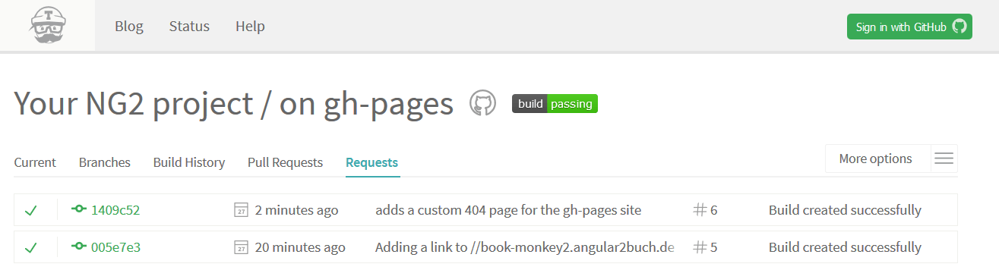

# angular-cli-ghpages
[![NPM version][npm-image]][npm-url]

<hr>



<hr>

Publish to any gh-pages branch on GitHub (or any other branch on any other remote).  
Made for angular-cli users.  
Made with Travis-CI in mind.  
Brought to you by the [angular.schule](https://angular.schule/) team! 

## About

This command is similar to the old `github-pages:deploy` command of @angular/cli which was removed in [#4385](https://github.com/angular/angular-cli/pull/4385).
The [angular-cli-ghpages](https://github.com/angular-schule/angular-cli-ghpages) command is able to push to any branch on any repository. It's made on top of [tschaub/gh-pages](https://github.com/tschaub/gh-pages).
**This script works great on [Travis-CI](https://travis-ci.org/).** No git credentials must be set up in before. Specific environment variables of Travis-CI are evaluated, too. You will like it!

## Changelog

A detailed changelog is available in the [releases](https://github.com/angular-schule/angular-cli-ghpages/releases) section.


## Installation & Setup

This command has the following prerequisites:

- Node.js 4.x
- Git 1.7.6 or higher
- __optional__: Angular project created via [angular-cli](https://github.com/angular/angular-cli)

To install the command run the following:

```bash
npm i -g angular-cli-ghpages
```

## Usage

Execute `angular-cli-ghpages` in order to deploy the project with a build from `dist` folder.  
__Note: you have to create the  `dist` folder in before (e.g. `ng build --prod`)__

Usage:

```bash
ng build --prod --base-href "https://USERNAME.github.io/REPOSITORY_NAME/"
angular-cli-ghpages [OPTIONS]
```

or

```bash
ng build --prod --base-href "/REPOSITORY_NAME/"
angular-cli-ghpages [OPTIONS]
```

or (`<base href="">` stays untouched)

```bash
ng build --prod
angular-cli-ghpages [OPTIONS]
```

there is also a shorter `ngh` command available

```bash
ng build --prod --base-href "https://USERNAME.github.io/REPOSITORY/"
ngh [OPTIONS]
```

If you want to push to `gh-pages` on the same repository with your default credentials, then just enter `ngh` without any options.

## Options


#### <a id="help">--help</a>
 * Example: `ngh --help`

Output usage information.


#### <a id="version">--version</a>
 * Example: `ngh --version`

Output the version number. Please provide the version number on any bug report!


#### <a id="repo">--repo</a>
 * __optional__
 * Default: url of the origin remote of the current dir (assumes a git repository)
 * Example: `ngh --repo=https://GH_TOKEN@github.com/organisation/your-repo.git`

By default, __gh-pages__ assumes that the current working directory is a git repository,
and that you want to push changes to the `origin` remote.
If instead your files are not in a git repository, or if you want to push to another repository,
you can provide the repository URL in the `repo` option.


#### <a id="message">--message</a>
 * __optional__
 * Default: `Auto-generated commit`
 * Example: `ngh --message="What could possibly go wrong?"`

The commit message, __must be wrapped in quotes__.  
Some handy additional text is always added,
if the environment variable `process.env.TRAVIS` exists (for Travis CI).


#### <a id="branch">--branch</a>
 * __optional__
 * Default: `gh-pages`
 * Example: `ngh --branch=other-branch`
 
The name of the branch you'll be pushing to.
The default uses GitHub's `gh-pages` branch,
but this can be configured to push to any branch on any remote.


#### <a id="name">--name & --email</a>
 * __optional__
 * Default: value of `git config user.name` and `git config user.email`
 * Example: `ngh --name="Displayed Username" --email=mail@example.org`

If you are running the command in a repository without a `user.name` or `user.email` git config properties
(or on a machine without these global config properties),
you must provide user info before git allows you to commit.
In this case provide both `name` and `email` string values to identify the committer.


#### <a id="no-silent">--no-silent</a>
 * __optional__
 * Default: silent `true` (boolean)
 * Example:
    * `ngh` -- Logging is in silent mode by default.
    * `ngh --no-silent` -- Logging shows extended information.

Logging is in silent mode by default.
In silent mode log messages are suppressed and error messages are sanitized.

The `--no-silent` option enables extended console logging.
Keep this untouched if the repository URL or other information passed to git commands is sensitive!

> WARNING: This option should kept like it is if the repository URL or other information passed to git commands is sensitive and should not be logged (== you have a public build server). By default the silent mode is enabled to avoid sensitive data exposure.


#### <a id="dir">--dir</a>
 * __optional__
 * Default: `dist`

Directory for all published sources, relative to the project-root.  
Most probably no change is required here.
This option can be used to deploy completely different folders,
which are not related at all to angular.


#### <a id="no-dotfiles">--no-dotfiles</a>
 * __optional__
 * Default: dotfiles `true` (boolean)
 * Example:
    * `ngh` -- Dotfiles are included by default.
    * `ngh --no-dotfiles` -- Dotfiles are ignored.

The command includes dotfiles by default (e.g `.htaccess` will be committed)
With `--no-dotfiles` files starting with `.` are ignored.


#### <a id="dry-run">--dry-run</a>
 * __optional__
 * Default: `undefined`
 * Example:
    * `ngh` -- Normal behaviour: Changes are applied.
    * `ngh --dry-run` -- No changes are applied at all.

Run through without making any changes. This can be very usefull, because it outputs what would happend without doing anything.

## Extra

For your convenience, the command will recognize the [environment variable](https://docs.travis-ci.com/user/environment-variables/#Defining-Variables-in-Repository-Settings) `GH_TOKEN` and will replace this pattern in the `--repo` string. Please __do NOT disable the silent mode__ if you have any credentials in the repository URL! Read more about [Github tokens here](https://help.github.com/articles/creating-an-access-token-for-command-line-use/).

In example, the following command runs [on our Travis-CI](https://travis-ci.org/angular-buch/book-monkey2):

```bash
angular-cli-ghpages --repo=https://GH_TOKEN@github.com/organisation/your-repo.git --name="Displayed Username" --email=mail@example.org
```
> You have to treat the GH_TOKEN as secure as a password!

## FAQ

Before posting any issue, [please read the FAQ first](https://github.com/angular-schule/angular-cli-ghpages/wiki/FAQ).

## License
Code released under the [MIT license](LICENSE).

<hr>

  

### &copy; 2017 https://angular.schule

[npm-url]: https://www.npmjs.com/package/angular-cli-ghpages
[npm-image]: https://badge.fury.io/js/angular-cli-ghpages.svg
